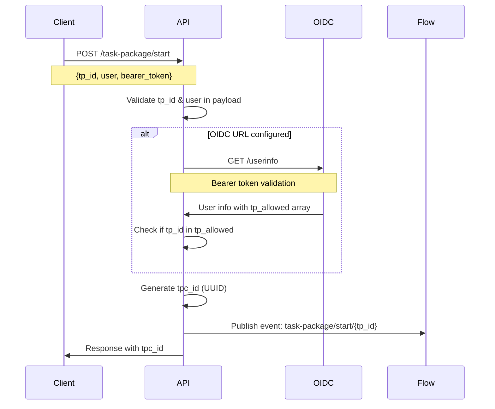

# Node-RED Task Package Design Document

## Overview

The **node-red-task-package** module is a workflow orchestrator that provides a higher-layer abstraction for managing task execution flows. It enables external users to trigger Node-RED flows via REST API calls or internal events, with built-in security, validation, and lifecycle management capabilities.

**Key Features**:
- **Parallel Task Execution**: Multiple task packages can run simultaneously within the same flow
- **Event-Driven Cancellation**: Robust cancellation system with proper event propagation
- **Flexible Payload Handling**: Dynamic payload extraction with tp_id/user as control parameters
- **Auto-Discovery**: tp-cancel nodes automatically discover and monitor all active tasks
- **Database Synchronization**: Automatic task_packages table updates on deployment

## Architecture

### System Components

```
┌─────────────────┐    ┌─────────────────┐    ┌─────────────────┐
│   External      │    │   API Layer     │    │  Service Layer  │
│   Client        │────│  (Controller)   │────│  (Node-RED      │
│                 │    │                 │    │   Flows)        │
└─────────────────┘    └─────────────────┘    └─────────────────┘
                              │
                              │
                       ┌─────────────────┐
                       │   Security      │
                       │   Layer         │
                       │  (Keycloak)     │
                       └─────────────────┘
```

### Key Features

- **External API Access**: REST API endpoints for task lifecycle management
- **Parallel Task Support**: Multiple task packages can execute simultaneously per flow
- **Security Integration**: Keycloak-based authentication and authorization
- **Event-Driven Architecture**: Internal event system with proper event propagation
- **Schema Validation**: JSON schema validation for request payloads
- **Database Persistence**: SQLite-based task state management with auto-synchronization
- **Flexible Flow Design**: Modular node system with dual communication patterns
- **Auto-Discovery Cancellation**: tp-cancel nodes monitor all active tasks automatically
- **Dynamic Payload Extraction**: tp_id/user as control parameters, everything else as payload

## API Layer

### Security Flow



### REST Endpoints

#### GET `/task-package/status`
**Purpose**: Retrieve available task packages for the authenticated user

**Response Format**:
```json
[
    {
        "id": "tp01",
        "name": "linen_delivery", 
        "form_url": "/dashboard/linen_delivery",
        "created_at": "2025-09-18 04:35:42",
        "updated_at": "2025-09-18 04:35:42"
    }
]
```

**Note**: The `form_url` is returned exactly as stored in the database without any path manipulation

#### GET `/task-package`
**Purpose**: List all available task package definitions

**Query Parameters**:
- `tp_id` (optional): Get specific task package by ID

**Response Format**: Same as `/task-package/status` with complete form URLs constructed

#### GET `/task-package/status/:tpc_id`
**Purpose**: Get specific task package instance status

**Response**: Same format as above, filtered by `tpc_id`

#### POST `/task-package/start`
**Purpose**: Initialize a new task package execution

**Request Body**:
```json
{
    "tp_id": "tp01",
    "user": "sbrow",
    "custom_field": "value",
    "another_field": 123,
    "complex_data": {
        "nested": "object"
    }
}
```

**Payload Processing**:
- `tp_id` and `user` are extracted as control parameters
- All other fields become `msg.payload` in the flow
- Supports dynamic, schema-free payload structures

**Headers**: 
- `Authorization: Bearer <token>` (if Keycloak configured)

**Response**:
```json
{
    "tpc_id": "550e8400-e29b-41d4-a716-446655440000",
    "status": "started"
}
```

#### POST `/task-package/cancel`
**Purpose**: Cancel a running task package

**Request Body**:
```json
{
    "tp_id": "tp01",
    "tpc_id": "550e8400-e29b-41d4-a716-446655440000"
}
```

## Service Layer (Node-RED Nodes)

### Node Specifications

#### Configuration Node: `tp-config`
**Purpose**: Global configuration for task package system

**Configuration Properties**:
- `oidc_url`: OIDC provider URL (optional)
  - Auto-detects provider type (Keycloak, Auth0, Azure AD, Okta, Google, AWS Cognito)
  - Example: `http://10.233.0.80:8080/realms/chart-sandbox`
  - If empty, security layer is bypassed
- `db_url`: Database file path (default: `/tmp/sqlite`)

#### Flow Control Nodes

##### `tp-start` (Entry Point)
- **Inputs**: None
- **Outputs**: 1 (main flow)
- **Purpose**: Entry point for task package flows

**Configuration**:
- `tp_id`: Unique task package identifier (e.g., "tp01")
- `tp_name`: Human-readable name (e.g., "Linen Delivery")  
- `tp_form_url`: Form endpoint path as stored in database (e.g., "/dashboard/linen_delivery")
- `tp_schema`: JSON schema for payload validation

**Behavior**:
1. Listens to `task-package/start/{tp_id}` events
2. Filters by matching `tp_id`
3. Validates payload against `tp_schema` (if configured)
4. Updates database status to 'underway'
5. Stores task context in both node instance and flow context
6. Auto-updates task_packages table on deployment
7. Outputs `msg.tp_data` with task context and `msg.payload` with dynamic data

**Parallel Task Support**:
```javascript
// Node instance storage (for this specific task)
this.current_tpc_id = tpc_id
this.current_tp_id = this.tp_id
this.task_cancelled = false

// Flow context active tasks array (for multiple parallel tasks)
const active_tasks = flow.get('active_tasks') || []
active_tasks.push({
    tpc_id: tpc_id,
    tp_id: this.tp_id,
    tp_name: this.tp_name,
    start_node_id: node.id,
    started_at: new Date().toISOString()
})
flow.set('active_tasks', active_tasks)

// Legacy single-task context (backward compatibility)
flow.set('current_tpc_id', tpc_id)
flow.set('current_tp_id', this.tp_id)
flow.set('task_cancelled', false)
```

**Database Auto-Synchronization**:
```javascript
// Automatic task_packages table update on node deployment
taskPackageDB.upsertTaskPackage(this.tp_id, this.tp_name, this.tp_form_url)
```

**Message Output**:
```javascript
msg.tp_data = {
    tpc_id: "550e8400-e29b-41d4-a716-446655440000",
    tp_id: "tp01",
    tp_name: "linen_delivery",
    user: "sbrow",
    status: "underway",
    mode: "start",
    created_at: "2025-09-16T10:30:00Z",
    updated_at: "2025-09-16T10:30:00Z"
}

msg.payload = {
    custom_field: "value",
    another_field: 123,
    complex_data: {
        nested: "object"
    }
    // Everything except tp_id and user from original request
}
```

##### `tp-end` (Exit Point)
- **Inputs**: 1 (from flow)
- **Outputs**: None
- **Purpose**: Terminate task package execution

**Behavior**:
1. Receives `msg.tp_data` via message passing from upstream nodes
2. Identifies specific task by `msg.tp_data.tpc_id`
3. Finds task in active_tasks array or checks legacy context
4. Determines cancellation status for this specific task
5. Updates status to 'completed' or 'cancelled' in database
6. Removes task from active_tasks array
7. Cleans up legacy context if this was the current task

**Parallel Task Handling**:
```javascript
const tpc_id = msg.tp_data.tpc_id
const active_tasks = flow.get('active_tasks') || []
const task_index = active_tasks.findIndex(task => task.tpc_id === tpc_id)

if (task_index !== -1) {
    const task = active_tasks[task_index]
    const wasCancelled = task.cancelled || false
    
    // Remove this specific task from active tasks
    active_tasks.splice(task_index, 1)
    flow.set('active_tasks', active_tasks)
    
    // Update database with final status
    const finalStatus = wasCancelled ? 'cancelled' : 'completed'
    await taskPackageDB.updateTaskStatus(tpc_id, finalStatus, message)
}
```

##### `tp-cancel` (Cancellation Handler)
- **Inputs**: None
- **Outputs**: 1 (cancellation flow)
- **Purpose**: Auto-discover and handle cancellation for all active tasks

**Behavior**:
1. **Auto-Discovery**: Monitors flow context for all active tasks
2. **Multi-Task Support**: Listens to cancel events for multiple tasks simultaneously  
3. **Dynamic Registration**: Automatically starts/stops listening as tasks start/finish
4. **Event Processing**: Processes `task-package/cancel/{tpc_id}` events
5. **Flow Context Updates**: Sets task-specific cancellation flags
6. **Status Reporting**: Shows count of monitored tasks in node status

**Parallel Task Monitoring**:
```javascript
// Track multiple task listeners
node._active_listeners = new Set() // Set of tpc_ids being monitored
node._event_handlers = new Map()   // Map of tpc_id -> {eventName, handler}

// Auto-discovery loop checks for new tasks
setInterval(() => {
    const active_tasks = flow.get('active_tasks') || []
    
    // Start listening to new tasks
    active_tasks.forEach(task => {
        if (!node._active_listeners.has(task.tpc_id)) {
            const handler = (payload) => handleCancelEvent.call(node, payload, task.tpc_id)
            const eventName = tpEvents.onCancel(task.tpc_id, handler)
            
            node._event_handlers.set(task.tpc_id, {eventName, handler})
            node._active_listeners.add(task.tpc_id)
        }
    })
    
    // Clean up listeners for completed tasks
    // ...
}, 1000)
```

**Cancellation Processing**:
```javascript
function handleCancelEvent(payload, tpc_id) {
    // Find specific task in active_tasks array
    const active_tasks = flow.get('active_tasks') || []
    const task_index = active_tasks.findIndex(task => task.tpc_id === tpc_id)
    
    if (task_index !== -1) {
        // Mark this specific task as cancelled
        const task = active_tasks[task_index]
        task.cancelled = true
        task.cancelled_at = new Date().toISOString()
        
        active_tasks[task_index] = task
        flow.set('active_tasks', active_tasks)
        
        // Output cancellation message
        node.send({
            tp_data: {
                tpc_id: tpc_id,
                tp_id: task.tp_id,
                mode: 'cancel',
                cancelled_at: task.cancelled_at
            },
            payload: payload.payload || {}
        })
    }
}
```

##### `tp-update-user-status` (Status Update)
- **Inputs**: 1 (from flow)
- **Outputs**: None
- **Purpose**: Update user-defined status information

**Configuration**:
- `user_status`: Custom status message

**Behavior**:
1. Updates `user_status` column in database
2. Updates `updated_at` timestamp
3. Does not change main `status` field

##### `tp-delay` (Cancellable Delay)
- **Inputs**: 1 (from flow)
- **Outputs**: 2 (success, cancelled)
- **Purpose**: Introduce time delays with cancellation support

**Configuration**:
- `delay_time`: Delay duration in milliseconds

**Behavior**:
1. Starts delay timer on message receipt
2. Extracts `tpc_id` from `msg.tp_data.tpc_id`
3. Monitors task-specific cancellation via active_tasks array
4. Supports both new parallel format and legacy single-task format
5. Output 1: Normal completion after delay
6. Output 2: Early termination due to cancellation

**Task-Specific Cancellation Checking**:
```javascript
const isTaskCancelled = () => {
    const tpc_id = msg.tp_data.tpc_id
    const active_tasks = flow.get('active_tasks') || []
    const task = active_tasks.find(t => t.tpc_id === tpc_id)
    
    // Check new parallel format
    if (task && task.cancelled) return true
    
    // Check legacy format for backward compatibility
    if (flow.get('current_tpc_id') === tpc_id && flow.get('task_cancelled')) return true
    
    return false
}

// Periodic cancellation check during delay
const cancelCheck = setInterval(() => {
    if (isTaskCancelled()) {
        clearTimeout(timer)
        clearInterval(cancelCheck)
        
        // Output to second port (cancelled)
        send([null, {...msg, topic: 'delay-cancelled'}])
        done()
    }
}, 100)
```

#### Data Storage Nodes

##### `tp-data-store` (Task Data Storage)
- **Inputs**: 1 (data to store)
- **Outputs**: 1 (pass-through)
- **Purpose**: Store task data in global context for cross-flow sharing

**Configuration**:
- `storage_key`: Key field path in message (default: `tp_data.tpc_id`)
- `ttl_minutes`: Time-to-live in minutes (default: 60)
- `cleanup_interval`: Cleanup interval in minutes (default: 5)

**Behavior**:
1. Extracts storage key from incoming message using dot notation
2. Stores entire message in global context with TTL metadata
3. Automatically cleans up expired entries
4. Passes message through unchanged

**Storage Structure**:
```javascript
// Global context storage
globalContext.set('tp-data-store', {
    'tpc_123': {
        data: {msg}, // Complete message object
        expires_at: 1726657200000, // Timestamp
        stored_at: 1726653600000
    }
})
```

##### `tp-data-get` (Task Data Retrieval)
- **Inputs**: 1 (lookup request)
- **Outputs**: 1 (enriched data)
- **Purpose**: Retrieve stored task data and merge with current message

**Configuration**:
- `key_field`: Key field path in message (default: `tp_data.tpc_id`)
- `output_field`: Output field path (default: `stored_data`)
- `fail_on_missing`: Fail if data not found (default: true)
- `cleanup_on_get`: Remove data after retrieval (default: false)

**Behavior**:
1. Extracts lookup key from incoming message
2. Retrieves stored data from global context
3. Checks TTL and removes expired data
4. Merges stored data into output field using dot notation
5. Optionally removes data after retrieval

**Output Structure**:
```javascript
// Enhanced message with stored data
{
    ...original_message,
    stored_data: {
        tp_data: {...},
        payload: {...},
        // Complete stored message
    }
}
```

### Event System

#### Dual Communication Architecture
Task package nodes use two communication patterns:

**1. Message Passing (Data Flow)**:
- Primary method for passing task data through the flow
- `msg.tp_data` contains task metadata
- `msg.payload` contains dynamic user data
- Standard Node-RED message flow

**2. Flow Context (Coordination)**:
- Used for task coordination and cancellation signaling
- Supports both parallel tasks (active_tasks array) and legacy single-task format
- Enables auto-discovery and cross-node communication

#### Parallel Task Context Structure
```javascript
// Flow context stores array of active tasks
active_tasks: [
    {
        tpc_id: "550e8400-e29b-41d4-a716-446655440000",
        tp_id: "tp01",
        tp_name: "linen_delivery", 
        start_node_id: "node_abc123",
        started_at: "2025-09-16T10:30:00Z",
        cancelled: false,              // Set to true when cancelled
        cancelled_at: "2025-09-16T10:35:00Z"  // Set when cancelled
    },
    {
        tpc_id: "660f9500-f39c-52e5-b827-557766551111",
        tp_id: "tp02",
        tp_name: "medicine_delivery",
        start_node_id: "node_def456", 
        started_at: "2025-09-16T10:32:00Z",
        cancelled: false
    }
    // ... more parallel tasks
]

// Legacy context (for backward compatibility)
current_tpc_id: "550e8400-e29b-41d4-a716-446655440000"  // Most recent task
current_tp_id: "tp01"
task_cancelled: false  // Legacy flag
```

#### Event Flow Coordination
```javascript
// tp-start: Store task in both formats
this.current_tpc_id = tpc_id                    // Node instance
active_tasks.push({tpc_id, tp_id, ...})         // Flow context array
flow.set('current_tpc_id', tpc_id)              // Legacy context

// tp-cancel: Monitor all active tasks
const active_tasks = flow.get('active_tasks') || []
active_tasks.forEach(task => {
    // Listen for cancel events for each task
    tpEvents.onCancel(task.tpc_id, handler)
})

// tp-delay: Check task-specific cancellation
const task = active_tasks.find(t => t.tpc_id === msg.tp_data.tpc_id)
if (task && task.cancelled) { /* handle cancellation */ }

// tp-end: Remove completed task
const task_index = active_tasks.findIndex(task => task.tpc_id === tpc_id)
active_tasks.splice(task_index, 1)              // Remove from array
```

#### Event Topics
- `task-package/start/{tp_id}`: Task initiation events
- `task-package/cancel/{tpc_id}`: Task-specific cancellation events

#### Event Payloads
**Start Event Payload**:
```javascript
{
    tpc_id: "550e8400-e29b-41d4-a716-446655440000",
    tp_id: "tp01", 
    user: "sbrow",
    payload: {
        // All fields except tp_id and user from original request
        custom_field: "value",
        another_field: 123
    }
}
```

**Cancel Event Payload**:
```javascript
{
    tp_id: "tp01",
    tpc_id: "550e8400-e29b-41d4-a716-446655440000", 
    user: "sbrow",
    cancelled_by: "sbrow",
    cancelled_at: "2025-09-16T10:35:00Z",
    payload: {
        // Original cancel request fields
    }
}
```

## Database Schema

### Table: `task_packages`
**Purpose**: Registry of available task package definitions

```sql
CREATE TABLE IF NOT EXISTS task_packages (
    id TEXT PRIMARY KEY NOT NULL,       -- tp_id
    name TEXT NOT NULL,                 -- tp_name  
    form_url TEXT                       -- tp_form_url
);
```

**Data Management**:
- Auto-updated on every Node-RED deployment via tp-start nodes
- One record per `tp-start` node configuration
- Prevents duplicate `tp_id` values
- Synchronizes tp_name changes automatically

### Table: `task_packages_created`
**Purpose**: Execution instances of task packages

```sql
CREATE TABLE IF NOT EXISTS task_packages_created (
    id UUID PRIMARY KEY NOT NULL,              -- tpc_id
    tp_id TEXT NOT NULL,                       -- Reference to task_packages.id
    tp_name TEXT NOT NULL,                     -- Cached from task_packages
    user TEXT,                                 -- Requesting user
    user_status TEXT,                          -- Custom status from tp-update-user-status
    status TEXT NOT NULL DEFAULT 'created',   -- System status
    created_at TIMESTAMP NOT NULL DEFAULT CURRENT_TIMESTAMP,
    updated_at TIMESTAMP NOT NULL DEFAULT CURRENT_TIMESTAMP
);
```

**Status Values**:
- `created`: Initial state (API layer)
- `underway`: Execution started (tp-start)
- `completed`: Normal completion (tp-end)
- `cancelled`: User-requested cancellation (tp-end after tp-cancel)
- `cancelling`: Cancellation in progress (tp-cancel)

## Flow Patterns

### Parallel Task Execution
```
Flow 1: [tp-start:tp01] ──→ [business logic A] ──→ [tp-end]
Flow 2: [tp-start:tp02] ──→ [business logic B] ──→ [tp-end]

[tp-cancel] ──→ [cleanup logic]  // Monitors both tasks automatically
```
*Note: Single tp-cancel node can monitor multiple parallel tasks*

### Complex Parallel Flow with Delays
```
Task A: [tp-start:tp01] ──→ [logic-1] ──→ [tp-delay] ──→ [logic-2] ──→ [tp-end]
                                            │
                                            └─→ [timeout cleanup A]

Task B: [tp-start:tp02] ──→ [step-1] ──→ [tp-delay] ──→ [step-2] ──→ [tp-end]
                                         │
                                         └─→ [timeout cleanup B]

[tp-cancel] ──────────────────────→ [global cleanup]  // Monitors both tasks
```
*Note: Each tp-delay checks its specific task's cancellation status*

### Mixed Legacy and Parallel Support
```
[tp-start] ──→ [logic] ──→ [legacy tp-delay] ──→ [tp-end]
                           │
                           └─→ [handles both formats]

[tp-cancel] ──→ [cleanup]  // Works with both old and new context formats
```

### Status Reporting Flow
```
[tp-start] ──→ [step-1] ──→ [tp-update-user-status] ──→ [step-2] ──→ [tp-end]
                                │
                                └─→ (status: "processing step 1")
```

### Cross-Flow Data Sharing
```
Flow 1: [tp-start] ──→ [business logic] ──→ [tp-data-store] ──→ [tp-end]

Flow 2: [tp-cancel] ──→ [tp-data-get] ──→ [cleanup with stored data]
                         │
                         └─→ enriched with original task data
```

### Complex Data Persistence Pattern
```
Main Flow:   [tp-start] ──→ [tp-data-store] ──→ [process] ──→ [tp-end]
                            │
Cancel Flow: [tp-cancel] ──→ [tp-data-get] ──→ [restore state] ──→ [cleanup]
Update Flow: [external] ──→ [tp-data-get] ──→ [status check] ──→ [respond]
```

## Security Model

### OIDC Integration
When `oidc_url` is configured in `tp-config`:

1. **Auto-Detection**: Automatically detects OIDC provider type (Keycloak, Auth0, Azure AD, Okta, Google, AWS Cognito)
2. **Token Validation**: Bearer tokens validated against the OIDC provider's userinfo endpoint
3. **Authorization Check**: User's `tp_allowed` array checked for `tp_id`
4. **User Context**: User information attached to task execution

### Supported OIDC Providers
- **Keycloak**: Auto-detects `/protocol/openid-connect/userinfo` endpoint
- **Auth0**: Auto-detects `/userinfo` endpoint
- **Azure AD**: Auto-detects `/oidc/userinfo` endpoint
- **Okta**: Auto-detects `/v1/userinfo` endpoint
- **Google**: Uses `https://www.googleapis.com/oauth2/v2/userinfo`
- **AWS Cognito**: Auto-detects `/oauth2/userInfo` endpoint

### Sample OIDC Response
```json
{
    "tp_allowed": ["tp01", "tp02", "tp03"],
    "sub": "9cc6a977-c4e2-4516-bdf0-56830f2261f4",
    "email_verified": true,
    "name": "Sandra Brow Brow",
    "preferred_username": "sbrow",
    "expoPushToken": "ExponentPushToken[pMG_cyAmfUGv5jdhD8EALT]",
    "given_name": "Sandra Brow",
    "job_title": "Staff Nurse", 
    "family_name": "Brow",
    "email": "sbrow@email.com",
    "group": ["/ed/user"]
}
```

### Security Bypass
When `oidc_url` is not configured, the security layer is completely bypassed for development/testing scenarios.

## Implementation Notes

### Parallel Task Architecture
The system supports multiple concurrent task packages through a dual-context approach:

**Active Tasks Array** (New - Primary):
```javascript
// Supports unlimited parallel tasks
flow.set('active_tasks', [
    {tpc_id: "task1", tp_id: "tp01", cancelled: false},
    {tpc_id: "task2", tp_id: "tp02", cancelled: false}, 
    {tpc_id: "task3", tp_id: "tp01", cancelled: true}
])
```

**Legacy Context** (Backward Compatibility):
```javascript
// Single task tracking (for existing flows)
flow.set('current_tpc_id', 'most_recent_task_id')
flow.set('task_cancelled', false)
```

### Auto-Discovery Cancellation System
tp-cancel nodes automatically discover and monitor all active tasks:

1. **Periodic Discovery**: Checks active_tasks array every 1000ms
2. **Dynamic Registration**: Starts listening to new tasks automatically
3. **Automatic Cleanup**: Removes listeners for completed tasks
4. **Status Reporting**: Shows "Monitoring X task(s)" in node status
5. **Event Handlers**: Maintains Map of tpc_id → {eventName, handler}

### Database Auto-Synchronization
Task package definitions sync automatically:

```javascript
// tp-start nodes auto-update task_packages table on deployment
async function nodeInstance(config) {
    // ... node setup
    
    // Auto-sync on deployment
    setTimeout(async () => {
        try {
            const taskPackageDB = require('../lib/task-package-db')
            await taskPackageDB.upsertTaskPackage(this.tp_id, this.tp_name, this.tp_form_url)
        } catch (error) {
            this.warn(`Failed to update task package in database: ${error.message}`)
        }
    }, 2000)
}
```

### Dynamic Payload Processing
API layer separates control and data parameters:

```javascript
// API request body
{
    "tp_id": "tp01",      // Control parameter
    "user": "admin",      // Control parameter  
    "field1": "value1",   // Data parameter
    "field2": "value2"    // Data parameter
}

// Processed in API
const { tp_id, user, ...payload } = req.body

// Emitted to flow
taskPackageEvents.emitStart(tp_id, {
    tpc_id, tp_id, user,
    payload: payload      // {field1: "value1", field2: "value2"}
})

// Received in tp-start
msg.tp_data = {id: tpc_id, tp_id, user, ...}
msg.payload = {field1: "value1", field2: "value2"}
```

### Node Registration
All task package nodes should appear in a dedicated palette category (e.g., "Task Package").

### Database Initialization
Tables are created automatically by the API layer on first startup.

### Event Bus
Internal event system uses Node-RED's native message passing with standardized topic patterns.

### Error Handling
- Invalid `tp_id`: Return 400 Bad Request
- Unauthorized `tp_id`: Return 403 Forbidden  
- Invalid `tpc_id`: Return 404 Not Found
- Schema validation failure: Return 422 Unprocessable Entity
- **Event System Failures**: Logged but don't break flow execution
- **Parallel Task Conflicts**: Each task maintains independent state
- **Database Sync Failures**: Logged as warnings, don't prevent flow execution

### Deployment Considerations
- Database file permissions and persistence
- Network accessibility for external API calls  
- Keycloak endpoint availability and configuration
- Node-RED dashboard URL construction
- **Flow Context Memory**: active_tasks array grows with parallel execution
- **Event Listener Cleanup**: Automatic cleanup prevents memory leaks
- **Backward Compatibility**: Legacy flows continue working without modification

## Future Enhancements

### Planned Features
- Task package templates and inheritance
- Advanced retry and error handling  
- Metrics and monitoring integration
- Webhook notifications for task completion
- Multi-tenant support with workspace isolation
- **Performance Optimizations**: Batch event processing for high-throughput scenarios
- **Advanced Monitoring**: Real-time task execution dashboards
- **Cross-Flow Communication**: Task packages spanning multiple flows
- **Priority Queuing**: Task execution priority management

### Recently Implemented (v2.1)
- ✅ **Simplified OIDC Configuration**: Removed Keycloak-specific components, generic OIDC provider support
- ✅ **Multi-Provider OIDC**: Auto-detection for Keycloak, Auth0, Azure AD, Okta, Google, AWS Cognito
- ✅ **Cross-Flow Data Storage**: tp-data-store and tp-data-get nodes with TTL management
- ✅ **Field Naming Clarity**: Refactored tp_data.id to tp_data.tpc_id for better readability
- ✅ **Complete Form URLs**: API endpoints return fully constructed dashboard URLs
- ✅ **Configuration Auto-Discovery**: Only tp-start nodes show configuration dropdown
- ✅ **Parallel Task Execution**: Multiple tasks per flow  
- ✅ **Auto-Discovery Cancellation**: tp-cancel monitors all active tasks
- ✅ **Dynamic Payload Processing**: Flexible API parameter handling
- ✅ **Database Auto-Sync**: Automatic task_packages table updates
- ✅ **Backward Compatibility**: Legacy flows continue working
- ✅ **Event System Fixes**: Proper event parameter ordering and propagation
- ✅ **Robust Error Handling**: Graceful degradation and comprehensive logging

### Integration Points
- **RMF Nodes**: Task packages can orchestrate robot tasks
- **ROS2 Nodes**: Integration with ROS2 ecosystem
- **External Systems**: REST API enables integration with any external system
- **Dashboards**: Form-based user interfaces for task initiation

## Development Workflow

### Adding New Task Package Nodes
1. Create node implementation in `nodes/` directory
2. Follow existing naming convention (`tp-{function}.js`)
3. Implement event listening for cancellation support
4. Update database status appropriately
5. Add comprehensive error handling
6. Update this documentation

### Testing Strategy
- Unit tests for individual node behavior
- Integration tests for complete task package flows
- **Parallel Execution Tests**: Multiple concurrent tasks
- **Cancellation Tests**: Task-specific and cross-task cancellation
- Security testing with/without Keycloak
- Performance testing with concurrent task executions
- Database integrity validation
- **Event System Tests**: Event propagation and handler cleanup
- **Backward Compatibility Tests**: Legacy flow compatibility

### Performance Considerations
- **Memory Management**: active_tasks array cleanup and listener management
- **Event Handler Cleanup**: Automatic removal of completed task listeners  
- **Database Efficiency**: Batch operations and connection pooling
- **Concurrent Request Handling**: API layer supports multiple simultaneous requests
- **Flow Context Optimization**: Efficient array operations for large task counts

---

*This document serves as the authoritative reference for the node-red-task-package module design and implementation.*

**Document Version**: 2.1  
**Last Updated**: September 18, 2025  
**Key Changes**: Added tp-data storage nodes, simplified OIDC configuration with multi-provider support, improved field naming clarity (tpc_id), complete form URL construction, and configuration auto-discovery.
